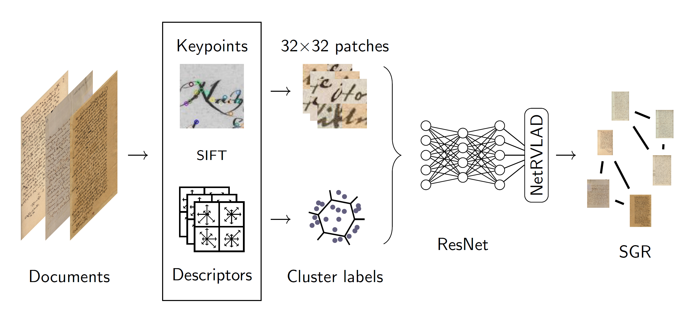

This repository contains the official code implementation of our paper 

Marco Peer, Florian Kleber and Robert Sablatnig : **Towards Writer Retrieval for Historical Datasets**,

an unsupervised approach using NetRVLAD and Similarity Graph Reranking, which will be presented at ICDAR 2023 this year. It is currently state of the art on the ICDAR17 (80.6% mAP) and ICDAR19 (93.2% mAP) dataset for writer retrieval. [Paper](https://arxiv.org/abs/2305.05358)

## Installation

Install the packages via

    pip install -r requirements.txt

The repository uses wandb for logging.

## Patch extraction

We provide four scripts (two with a color version each for RGB images) to extract the patches from the documents:

- extract_patches_only : only extracts patches without clustering (mainly used for test sets)
- extract_patches : extracts patches and clusters their descriptors (mainly used to train sets)

The respective configs for the scripts to reproduce our results are located in the config directory (config/config_patches.yml).

## Defining your dataset

If you use the patch extraction scripts provided, edit the paths of the respective dataset in writer_zoo.py:

    'icdar2017': {
        'basepath': BASEPATH,
        'set': {
            'test' :  {'path': YOUR_TEST_DIRECTORY,
                                'regex' : {'writer': '(\d+)', 'page': '\d+-IMG_MAX_(\d+)'}},

            'train' :  {'path': YOUR_TRAIN_DIRECTORY,
                                'regex' : {'cluster' : '(\d+)', 'writer': '\d+_(\d+)', 'page' : '\d+_\d+-\d+-IMG_MAX_(\d+)'}},
            
        }
    }

 The labels used for our repository are extracted by regular expressions. (supported: ICDAR2013, ICDAR2017, ICDAR2019 dataset, refer to our paper for more details).

## Training and testing

Run

    python main.py --gpuid=GPU_ID --config=config/icdar2017.yml

to run training on ICDAR2017. Afterward, testing is executed if a testset is specified in the config file. Refer to main.py for further commands.

## Rerank

For the reranking part, you are expected to provide an embedding file (.npy), then run

    python rerank.py --algorithm='sgr'

which creates the reranked descriptors and saves them. Refer to rerank.py for further commands and functionalities. 

## Citing

Please consider citing our paper if you find our resources helpful
        
    @inproceedings{10.1007/978-3-031-41676-7_24,
    author = {Peer, Marco and Kleber, Florian and Sablatnig, Robert},
    title = {Towards Writer Retrieval for&nbsp;Historical Datasets},
    year = {2023},
    booktitle = {Document Analysis and Recognition - ICDAR 2023: 17th International Conference, San Jos\'{e}, CA, USA, August 21–26, 2023, Proceedings, Part I},
    pages = {411–427},
    numpages = {17},
    location = {San Jos\'{e}, CA, USA}
    }
    
Feel free to reach out to us via mpeer(at)cvl.tuwien.ac.at in case you find errors or have questions about our paper.
